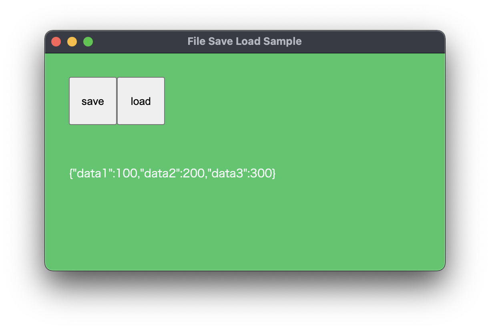

# Electron + p5js (File Save & Load)

Electron（Electron Fiddleではありません）とp5jsをつかった、JSONファイルのセーブとロードができるサンプルです。アプリケーションの設定をセーブ・ロードすることを想定しています。

JSONファイルは、同階層の「pref.json」という名前にしてあります。このファイルをロードするときに、ファイルの存在を確認してから、存在しなければデフォルトの値で新規作成するようにしています。

ファイルの存在を確認する部分がp5jsにはなかったので、nodejsのpathモジュールとfsモジュールを使って作っています。

</img>

https://user-images.githubusercontent.com/34113514/136553985-b1813133-b3af-4709-8a11-37104474e470.mov

